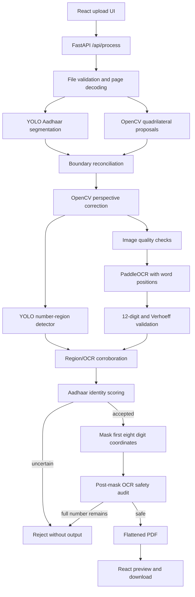

# Aadhaar Masking Workbench - Architecture and Technical Rationale

Status date: 5 October 2026  
Application type: React single-page application with a private FastAPI computer-vision backend

## 1. Executive summary

This application accepts an image or document, isolates Aadhaar content, corrects its perspective, verifies that the content is genuinely Aadhaar, and permanently covers only the first eight digits of every verified 12-digit Aadhaar number. The final four digits remain visible.

The system is intentionally fail-closed. It does not mask every 12-digit-looking string and it does not return a partially processed document. A debit card, uncertain crop, unreadable number, invalid checksum, or failed post-mask audit produces an error instead of an unsafe PDF.

The architecture is hybrid because no single model solves all parts reliably:

- YOLO answers: "Is this object an Aadhaar card or letter?"
- OpenCV answers: "Where are the true physical corners, and how should the document be straightened?"
- PaddleOCR answers: "What text is present, and where is each word/digit group located?"
- Aadhaar-specific validation answers: "Is this exactly a structurally valid Aadhaar number in an Aadhaar context?"
- The redaction and audit stages answer: "Were exactly the first eight digits covered, and can the complete number still be read?"

This combination is a strong fit for the problem because semantic recognition, geometry, text recognition, mathematical validation, and redaction safety are handled by separate components that cross-check one another.

## 2. End-to-end architecture



The processing sequence is:

1. Decode the uploaded file into RGB page images.
2. Run the Aadhaar-specific YOLO segmentation model.
3. Independently find likely physical card/page quadrilaterals with OpenCV.
4. Reconcile identity and geometry:
   - YOLO decides Aadhaar identity when it has sufficient confidence.
   - A strongly overlapping OpenCV rectangle can refine an incomplete YOLO mask to the complete physical boundary.
   - If YOLO misses entirely, an OpenCV rectangle remains only a candidate and must pass stricter content verification.
5. Convert the selected polygon into four ordered corners and apply a homography.
6. Reject crops that are too small, blurred, or low contrast.
7. Read the rectified document with PaddleOCR, including word-level positions.
8. Run the separate YOLO number-region model as independent corroboration.
9. Accept only Aadhaar-context text plus checksum-valid 12-digit lines.
10. Convert OCR words into twelve digit boxes and cover boxes 1-8 only.
11. OCR the masked image again. Reject the entire result if a complete valid Aadhaar number is still readable.
12. Return a flattened image-only PDF with no source text layer.

## 3. Frontend architecture

### React 19

React implements the single-page workflow:

- drag-and-drop or file-picker upload;
- local source preview;
- backend readiness state;
- processing/error state;
- masked PDF preview;
- masked PDF download;
- replacement of the current upload without reloading the page.

Main file: `src/App.jsx`

### Vite

Vite provides the development server and production frontend bundle. In development it proxies `/api` requests to FastAPI on port 8001.

Commands:

```powershell
npm run dev
npm run build
```

### PDF.js

`pdfjs-dist` renders uploaded and returned PDFs inside the browser. It is a preview component only; it does not perform the authoritative redaction.

### Mammoth and DOMPurify

Mammoth produces a browser preview for DOCX uploads. DOMPurify sanitizes that generated HTML before React displays it. The backend still performs the authoritative Word-to-PDF conversion and computer-vision processing.

## 4. Backend and API architecture

### FastAPI

FastAPI exposes two endpoints:

- `GET /api/health`: model and OCR readiness.
- `POST /api/process`: multipart upload and masked PDF response.

Main file: `backend/server.py`

The endpoint applies upload-size limits, page limits, type validation, serial processing, privacy headers, and structured errors.

Important response headers include:

- `X-Aadhaar-Documents`
- `X-Redacted-Regions`
- `X-Document-Classes`
- `X-Document-Confidence`
- `X-Verification-Confidence`
- `Cache-Control: no-store, private`

### Uvicorn

Uvicorn runs the ASGI service locally:

```powershell
.\.venv\Scripts\python.exe -m uvicorn backend.server:app --host 127.0.0.1 --port 8001 --no-access-log
```

Access logging is disabled in the documented command so routine logs do not retain private filenames.

## 5. Input and document handling

File: `backend/documents.py`

Supported inputs include:

- JPEG/JPG
- PNG
- WebP
- BMP
- TIFF
- GIF
- HEIC/HEIF
- PDF
- DOC/DOCX

Libraries and responsibilities:

- Pillow: raster image decoding, EXIF rotation, and RGB conversion.
- pillow-heif: HEIC/HEIF decoding.
- pypdfium2: render PDF pages to images.
- LibreOffice/soffice: convert Word files to PDF in a temporary directory.
- ReportLab: create the final flattened PDF.

The source upload is held only for the request. Word conversion uses a temporary directory. The returned PDF contains rendered pixels rather than selectable source text.

## 6. Aadhaar document detection

### Primary detector: Ultralytics YOLO segmentation

Runtime class: `UltralyticsDocumentSegmenter`  
File: `backend/detectors.py`  
Weight: `backend/models/aadhaar-document-seg.pt`

Classes:

- `aadhaar_front`
- `aadhaar_back`
- `aadhaar_letter`

Segmentation is preferred to a plain rectangular detector because it can represent rotated and perspective-distorted boundaries. The predicted polygon is more useful for document correction than an axis-aligned box.

YOLO performs semantic recognition: a similarly shaped debit card should not be labelled Aadhaar merely because both objects are rectangular.

### Geometric detector: OpenCV quadrilateral proposer

Runtime class: `OpenCvDocumentProposer`  
File: `backend/candidates.py`

OpenCV analyzes edges and brightness thresholds, closes broken borders, finds contours, keeps convex four-corner shapes, measures rectangularity, suppresses duplicates, and removes common nested portrait/QR rectangles.

OpenCV does not declare that a rectangle is Aadhaar. A geometric proposal can produce output only after strict OCR, identity-text, checksum, and post-mask checks.

### Boundary reconciliation

File: `backend/pipeline.py`

There are three paths:

1. YOLO detects Aadhaar and no matching rectangle exists: use the YOLO polygon.
2. YOLO detects Aadhaar and a strongly overlapping physical rectangle exists: preserve YOLO identity/confidence but use the OpenCV rectangle for complete corners.
3. YOLO misses: treat OpenCV rectangles as untrusted candidates and require stronger content corroboration.

The second path fixes an important real-world failure mode: a segmentation mask can identify an Aadhaar letter correctly while clipping a detachable lower card. The overlapping physical page boundary retains the whole page so every repeated Aadhaar number must be processed.

## 7. Perspective correction and quality checks

File: `backend/geometry.py`

OpenCV performs:

- convex-hull cleanup;
- polygon-to-four-corner conversion;
- stable corner ordering;
- slight boundary expansion;
- perspective transform/homography;
- orientation rotation;
- contrast enhancement for OCR;
- minimum-size checks;
- contrast checks;
- Laplacian blur scoring.

This is the same family of geometry used by document-scanner applications. It makes OCR operate on a straight, isolated Aadhaar rather than a tilted photograph containing fabric, tables, screens, or other cards.

## 8. Number localization and OCR

### Separate YOLO number-region detector

Runtime class: `UltralyticsNumberDetector`  
File: `backend/detectors.py`  
Weight: `backend/models/aadhaar-number-det.pt`  
Class: `aadhaar_number`

The detector supplies independent evidence that a line occupies the expected visual number region. Every detector box must resolve to a checksum-valid OCR line; an unmatched detector box causes rejection.

The detector is corroborative rather than the only coordinate source. Difficult camera/screen photos can defeat the number model while PaddleOCR still returns exact, checksum-valid word boxes. In that case, a verified Aadhaar document may use those exact OCR boxes and still undergo the post-mask audit. No guessed percentage-based mask is used.

### PaddleOCR

Files: `backend/ocr.py`, `backend/pipeline.py`

PaddleOCR is configured for CPU execution and word-position output. For every line it returns:

- recognized text;
- recognition confidence;
- line polygon;
- word text;
- word boxes.

The application never needs to store or log recognized identity text. OCR data remains in memory for the active request.

## 9. Aadhaar validation

File: `backend/validation.py`

A number is not accepted merely because it contains twelve digits. Validation requires:

- exactly 12 decimal digits after approved spaces/hyphens are removed;
- first digit is not 0 or 1;
- valid Verhoeff checksum;
- sufficient OCR confidence;
- Aadhaar identity/layout evidence;
- sufficient combined verification confidence.

Identity evidence can include:

- Aadhaar/Aadhar text;
- UIDAI text;
- Unique Identification Authority text;
- Government of India text;
- Aadhaar-layout phrases such as DOB/YOB, sex, address, or UIDAI help/site text;
- QR-like pattern;
- Aadhaar-specific YOLO detection;
- number-detector overlap.

For an OpenCV-only candidate, geometry provides almost no identity score. Acceptance requires all of the following:

- at least one checksum-valid Aadhaar number;
- at least one strong Aadhaar/Government identity anchor;
- another layout cue, QR cue, or second strong anchor;
- verification score at or above the configured threshold.

A 16-digit debit/credit-card number fails the length rule before masking.

## 10. Exact masking behavior

File: `backend/redaction.py`

The redactor:

1. Converts Unicode decimal characters to normalized digits.
2. Rejects unexpected letters mixed into a number line.
3. Requires OCR word positions.
4. Divides each OCR word box into per-digit boxes.
5. Confirms that the positioned digits exactly match the checksum-valid OCR line.
6. Builds a rectangle from digit boxes 1-8.
7. Stops the rectangle before digit 9, preserving digits 9-12.
8. Adds small horizontal/vertical safety margins so no stroke from digit 1 or digit 8 remains visible.

The mask is a filled, irreversible pixel rectangle. It is not blur, transparency, a removable PDF annotation, or CSS overlay.

Every valid number occurrence is masked. A full Aadhaar letter can contain the same number three times; all three must be covered.

## 11. Post-mask safety audit

File: `backend/pipeline.py`

After masking, PaddleOCR reads the output again. If any line still resolves to a complete checksum-valid Aadhaar number, the pipeline raises an unsafe-document error and returns no PDF.

This catches:

- missed repeated numbers;
- insufficient mask width;
- a second number occurrence outside the expected region;
- OCR/detector disagreement that could expose a complete number.

The pipeline also rejects partial success. If one detected Aadhaar can be masked but another cannot, no combined result is returned.

## 12. Dataset and training design

Files:

- `training/generate_synthetic_dataset.py`
- `training/validate_dataset.py`
- `training/train.py`
- `training/aadhaar-document-seg.yaml`
- `training/aadhaar-number.yaml`
- `training/README.md`

### Document segmentation annotations

Each Aadhaar instance uses a tight outer polygon and one of three classes:

- front;
- back;
- full letter/page.

Debit cards, credit cards, PAN cards, licences, visiting cards, screenshots, and blank rectangles use empty labels unless an Aadhaar is also present. In mixed scenes only Aadhaar receives a polygon.

### Number detector annotations

Every printed Aadhaar-number occurrence receives a tight box. A full letter with three occurrences receives three labels. Non-Aadhaar images use empty label files.

### Hard negatives

Hard negatives teach the model that card shape is insufficient. Important examples include:

- debit/credit cards;
- Aadhaar beside a debit card;
- PAN cards;
- driving licences;
- visiting cards;
- arbitrary 12- and 16-digit text;
- screenshots and photocopies;
- multiple cards;
- rotated, blurred, shadowed, glared, compressed, or partially occluded scenes.

### Privacy-safe bootstrap dataset

The current local bootstrap dataset is procedurally generated and contains no real personal data.

Document dataset totals:

- 252 images;
- 114/21/23 Aadhaar instances in train/validation/test;
- 81/18/15 negative images in train/validation/test.

Number dataset totals:

- 252 images;
- 160/35/39 number boxes in train/validation/test;
- 84/15/19 negative images in train/validation/test.

The supplied private Aadhaar and bank-card photos were not copied into the training datasets and were not used to train model weights.

### Training stack

- Ultralytics 8.4.172
- PyTorch 2.8.0
- CPU bootstrap training in this workspace
- task-specific augmentation for segmentation and number localization
- deterministic seed and locked test split

## 13. Measured model results

These are bootstrap results on an untouched synthetic test split, not a production certification.

### Document segmentation model

- mask precision: 0.981
- mask recall: 0.946
- mask mAP50: 0.982
- mask mAP50-95: 0.959

### Number-region model

- box precision: 0.998
- box recall: 1.000
- box mAP50: 0.995
- box mAP50-95: 0.667

The high synthetic scores prove that the training/runtime contracts work. They do not prove generalization to every phone, printer, Aadhaar format, blur level, or background.

## 14. Private acceptance results

The four user-supplied files were treated as a private engineering/regression set. No OCR text or complete identifier was printed in test reports.

| Case | Expected | Observed result |
|---|---|---|
| Debit card only | Reject; no PDF | HTTP 422 `no_aadhaar_detected`; no output |
| Aadhaar plus debit card | Return Aadhaar only; one mask | HTTP 200; one Aadhaar front; one redacted region; debit card excluded |
| Phone photo of full sheet | Complete page; three masks | HTTP 200; one Aadhaar letter; three redacted regions |
| Clean full sheet | Complete page; three masks | HTTP 200; one Aadhaar letter; three redacted regions |

All three positive outputs were rendered to PNG and visually inspected. The final four digits remain visible and the first eight are covered in every occurrence.

These files are regression fixtures, not an independent production benchmark, because implementation decisions were improved after observing their initial failures. A separate identity-disjoint real-world test set is still required.

## 15. Why this architecture is a strong fit

It is not accurate to call any stack universally "best." This architecture is a strong fit because it separates concerns and makes unsafe shortcuts difficult:

- YOLO contributes learned Aadhaar semantics.
- OpenCV contributes deterministic document geometry.
- PaddleOCR contributes exact text and word positions.
- Verhoeff validation removes most arbitrary 12-digit false positives.
- Context scoring prevents checksum alone from declaring Aadhaar.
- A separate number detector supplies independent localization evidence.
- Exact-coordinate redaction preserves only the requested final four.
- Post-mask OCR tests the result rather than assuming the mask worked.
- Fail-closed errors are safer than forcing every poor input to succeed.
- Local processing avoids sending identity documents to hosted inference APIs.

Roboflow can still be useful for annotation/versioning, but it is not part of runtime inference. Ultralytics is the model framework; Roboflow would be a dataset-management tool.

## 16. Security and privacy controls

Current controls:

- local backend by default;
- no cloud OCR or hosted inference call;
- source bytes kept only for the request;
- temporary Word conversion directory;
- no source/identifier logging in application code;
- no routine Uvicorn access log in the documented command;
- `Cache-Control: no-store, private` responses;
- filename normalization;
- upload-size, page-count, and pixel-count limits;
- image-only flattened output PDF;
- serialized model processing to prevent unsafe shared inference state.

Required infrastructure controls before internet deployment:

- TLS;
- authentication and authorization;
- rate limiting and quotas;
- isolated worker processes;
- malware scanning and sandboxed LibreOffice conversion;
- encrypted temporary storage if disk spooling is introduced;
- explicit retention/deletion policy;
- private metrics that never contain OCR text or identifiers;
- dependency and model supply-chain scanning;
- abuse monitoring and request timeouts.

## 17. Failure behavior

Examples of safe rejection:

- no Aadhaar boundary/candidate;
- card is too small or blurred;
- OCR cannot obtain all twelve digits;
- checksum is invalid;
- number region and OCR disagree;
- Aadhaar identity confidence is insufficient;
- exact word positions are unavailable;
- masking geometry could touch the preserved final four;
- post-mask OCR can still recover a complete valid number;
- one of several Aadhaar instances cannot be processed safely.

The application must never lower thresholds simply to make a difficult demo image pass.

## 18. Source-code component map

| Component | Responsibility |
|---|---|
| `src/App.jsx` | React upload, preview, processing, error, download flow |
| `src/style.css` | Landing/upload interface styling |
| `src/processing.css` | Processing/result interface styling |
| `backend/server.py` | FastAPI lifecycle, health, upload endpoint, response headers |
| `backend/documents.py` | Image/PDF/Word decoding and flattened PDF creation |
| `backend/detectors.py` | YOLO document and number model adapters |
| `backend/candidates.py` | OpenCV quadrilateral proposals and deduplication |
| `backend/geometry.py` | Four corners, homography, rotation, OCR enhancement, quality checks |
| `backend/ocr.py` | PaddleOCR loading and normalized line/word positions |
| `backend/validation.py` | Verhoeff and Aadhaar identity verification |
| `backend/redaction.py` | Per-digit geometry and first-eight masking |
| `backend/pipeline.py` | End-to-end orchestration and fail-closed policy |
| `backend/settings.py` | Environment-driven thresholds and limits |
| `backend/errors.py` | Safe structured processing errors |
| `backend/tests/` | Geometry, validation, masking, proposal, and pipeline regressions |
| `training/` | Dataset generation/audit, model training, and release guidance |

## 19. Runtime configuration

Important environment variables:

```text
AADHAAR_DOCUMENT_MODEL
AADHAAR_NUMBER_MODEL
AADHAAR_YOLO_DEVICE
AADHAAR_DOCUMENT_CONFIDENCE
AADHAAR_NUMBER_CONFIDENCE
AADHAAR_VERIFICATION_CONFIDENCE
AADHAAR_OCR_CONFIDENCE
AADHAAR_INFERENCE_SIZE
AADHAAR_MAX_UPLOAD_BYTES
AADHAAR_MAX_PAGES
AADHAAR_MAX_PAGE_PIXELS
AADHAAR_MIN_REGION_EDGE
AADHAAR_MIN_BLUR_SCORE
```

The default local YOLO inference size is 640. The bootstrap models were trained at 384/512, and 640 avoids severe CPU contention with PaddleOCR while retaining appropriate model detail.

## 20. Running and testing

Install:

```powershell
python -m venv .venv
.\.venv\Scripts\python.exe -m pip install --upgrade pip
.\.venv\Scripts\python.exe -m pip install -r backend\requirements.txt
npm install
```

Start FastAPI:

```powershell
.\.venv\Scripts\python.exe -m uvicorn backend.server:app --host 127.0.0.1 --port 8001 --no-access-log
```

Start React in a second terminal:

```powershell
npm run dev
```

Run automated checks:

```powershell
.\.venv\Scripts\python.exe -m unittest discover -s backend\tests -v
npm run build
```

## 21. Production release gates

Before claiming production readiness, create a consented, de-identified, identity-disjoint real-world dataset and report:

- document recall by front/back/letter;
- false-positive rate on debit cards and other IDs;
- polygon IoU and corner error;
- number-region recall for every printed occurrence;
- OCR/checksum success by blur, glare, rotation, device, print, screenshot, and photocopy condition;
- end-to-end unsafe-output rate;
- rejection rate and reason distribution;
- p50, p95, and p99 latency;
- CPU/GPU memory usage;
- behavior under malformed and adversarial uploads.

No near-duplicate or image from the same identity/source capture may cross training, validation, and test splits.

## 22. Known limitations

- The current trained weights are a privacy-safe synthetic bootstrap, not production-certified real-world models.
- The OpenCV/OCR fallback makes the supplied real cases workable but does not guarantee every unseen Aadhaar format.
- Severe blur, occlusion, glare, cropping, or tiny text must be rejected.
- CPU processing of dense full sheets can take roughly 1-3 minutes on the current machine; a GPU or optimized model runtime is recommended for production latency.
- The current OCR configuration emphasizes English/Latin recognition. A reviewed multilingual model may be needed for Hindi-only anchors.
- QR presence is a visual signal; the current application does not cryptographically validate UIDAI QR signatures.
- The service masks identifiers; it does not authenticate a person or validate Aadhaar status with UIDAI.
- DOC/DOCX support requires LibreOffice on the backend.
- Ultralytics is AGPL-3.0 with a separate enterprise option. Commercial deployment requires a licensing review.

## 23. Recommended next steps

1. Collect consented and privacy-reviewed real Aadhaar front/back/letter examples plus hard negatives.
2. Annotate complete boundary polygons and every number occurrence.
3. Split by identity/source before augmentation.
4. Train on a CUDA machine at production image sizes.
5. Calibrate thresholds only on locked validation data.
6. Evaluate once on a locked, identity-disjoint test set.
7. Export an optimized runtime such as ONNX/TensorRT only after parity testing.
8. Add authenticated, isolated deployment infrastructure.
9. Keep the post-mask OCR audit even after model accuracy improves.

## 24. Short answers for CTO review

**Why not OCR the whole upload and mask any 12 digits?**  
That can mask debit-card or unrelated numbers and can miss perspective-distorted Aadhaar text. Aadhaar is isolated and verified first.

**Why both YOLO and OpenCV?**  
YOLO understands object identity; OpenCV provides precise deterministic corners. Each solves a different problem.

**Why a second number model if OCR has coordinates?**  
It supplies independent localization evidence and catches OCR/layout disagreement. Exact OCR boxes remain a controlled fallback on strongly verified Aadhaar documents.

**How are debit cards rejected?**  
They are hard negatives for YOLO, have 16 rather than 12 digits, lack Aadhaar identity anchors, and do not pass Verhoeff/context verification.

**How do we know only the first eight digits were hidden?**  
The mask is derived from twelve per-digit positions, ends before digit nine, and is visually regression-tested. The complete output is OCR-audited again.

**Can it process every image?**  
No responsible system can guarantee every blurred, cropped, or obstructed image. Production-safe behavior is to reject uncertain inputs.

**Are uploads sent to Roboflow or another cloud?**  
No. Current inference is local. Roboflow would be optional dataset tooling only.

**Is it production-ready now?**  
The code path is production-oriented and the supplied acceptance cases pass. A production claim still requires an independent consented real-world evaluation set, deployment security controls, performance testing, and licensing review.
