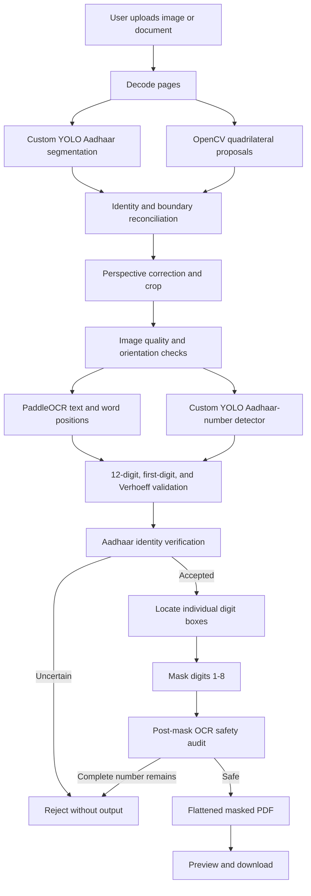

# System Diagram

```mermaid
flowchart TD
    A[User uploads image or document] --> B[Decode pages]
    B --> C[Custom YOLO Aadhaar segmentation]
    B --> D[OpenCV quadrilateral proposals]
    C --> E[Identity and boundary reconciliation]
    D --> E
    E --> F[Perspective correction and crop]
    F --> G[Image quality and orientation checks]
    G --> H[PaddleOCR text and word positions]
    G --> I[Custom YOLO Aadhaar-number detector]
    H --> J[12-digit, first-digit, and Verhoeff validation]
    I --> J
    J --> K[Aadhaar identity verification]
    K -->|Accepted| L[Locate individual digit boxes]
    K -->|Uncertain| X[Reject without output]
    L --> M[Mask digits 1-8]
    M --> N[Post-mask OCR safety audit]
    N -->|Complete number remains| X
    N -->|Safe| O[Flattened masked PDF]
    O --> P[Preview and download]
```
